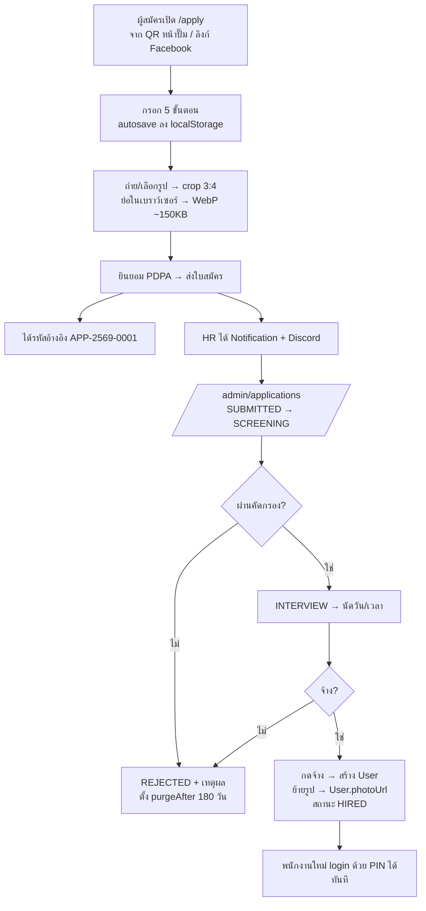

# ออกแบบฟีเจอร์: ใบสมัครงานพนักงานใหม่ (Job Application)

เอกสารออกแบบสำหรับเพิ่มระบบรับสมัครงานเข้า TimeTrack — ผู้สมัครกรอกใบสมัครออนไลน์ **พร้อมแนบรูปถ่าย** และเอกสารประกอบ, HR คัดกรอง/นัดสัมภาษณ์, และกดปุ่มเดียวเพื่อ **แปลงผู้สมัครเป็นพนักงาน** (สร้าง `User`) โดยข้อมูลและรูปถ่ายไหลต่อไปยังโปรไฟล์พนักงานทันที

สถานะ: **เฟส 1–4 เสร็จแล้ว** (สคีมา, storage adapter, `<PhotoCaptureField />`, ฟอร์ม `/apply` สาธารณะ 5 ขั้นตอน + API รับสมัคร/เช็คสถานะ/ถอนใบสมัคร) — ทดสอบจริงจนสมัครงานสำเร็จ, เห็นไฟล์บน Cloudinary, และถอนใบสมัครแล้วเช็คว่าสำเนาบัตรถูกลบจริงแล้ว เหลือเฟส 5–7 (`/admin/applications`, ปุ่มจ้างงาน, cron cleanup) ดู [ข้อ 11](#11-แผนงาน) และ [ข้อ 12](#12-ข้อสรุปที่ตัดสินใจแล้ว-และที่ยังค้าง)

**ข้อสรุปหลัก 3 ข้อ (ตัดสินใจแล้ว 15 ส.ค. 2569)**
1. เก็บไฟล์บน **Cloudinary** แบบ `type: authenticated` + signed URL อายุสั้น (ไม่ใช่ public URL)
2. **เปิดฟอร์มสาธารณะ** ให้ผู้สมัครกรอกเองผ่าน QR/ลิงก์
3. **เก็บสำเนาบัตรประชาชนตั้งแต่ตอนสมัคร** → ต้องยกระดับมาตรการ PDPA ตามข้อ 9

---

## 1) ขอบเขต

**อยู่ในขอบเขต (MVP)**
- ฟอร์มสมัครงานสาธารณะ ไม่ต้อง login — `/apply` (mobile-first เพราะผู้สมัครส่วนใหญ่กรอกจากมือถือหน้าปั๊ม)
- แนบรูปถ่ายหน้าตรง (บังคับ) + สำเนาบัตรประชาชน (บังคับ) + วุฒิการศึกษา / Resume (ไม่บังคับ)
- ผู้สมัครเช็คสถานะได้ด้วยรหัสอ้างอิง — `/apply/status`
- หน้า HR คัดกรอง — `/admin/applications` (list + ตัวกรอง + หน้ารายละเอียด + เปลี่ยนสถานะ)
- ปุ่ม "จ้างเป็นพนักงาน" สร้าง `User` จากใบสมัคร พร้อมย้ายรูปถ่ายไป `User.photoUrl`
- แจ้งเตือน HR ผ่าน in-app Notification + Discord webhook เมื่อมีใบสมัครใหม่
- PDPA: ข้อความยินยอม + เก็บเวอร์ชันคำยินยอม + กำหนดอายุการเก็บข้อมูล + ปุ่มลบถาวร

**เฟสถัดไป (ยังไม่ทำตอนนี้)**
- `JobOpening` — ประกาศรับสมัครแยกตำแหน่ง/สาขา พร้อม slug + QR โปสเตอร์หน้าปั๊ม
- Kanban board ลากสถานะ, ตารางนัดสัมภาษณ์ผูกปฏิทิน
- คะแนนสัมภาษณ์แบบมี rubric หลายผู้ประเมิน
- ส่ง SMS/LINE แจ้งผลผู้สมัคร

---

## 2) Flow



**สถานะใบสมัคร**: `DRAFT → SUBMITTED → SCREENING → INTERVIEW → OFFERED → HIRED` / `REJECTED` / `WITHDRAWN`

---

## 3) Data model (Prisma)

เพิ่มใน `prisma/schema.prisma`

```prisma
model JobApplication {
  id                String            @id @default(cuid())
  refCode           String            @unique          // APP-2569-0001 ใช้ให้ผู้สมัครเช็คสถานะ
  status            ApplicationStatus @default(SUBMITTED)

  // --- ตำแหน่งที่สมัคร ---
  positionTitle     String
  employmentType    String?                            // FULL_TIME | PART_TIME | DAILY
  stationId         String?
  departmentId      String?
  expectedSalary    Decimal?
  availableFrom     DateTime?
  preferredShifts   Json?                              // ["MORNING","NIGHT"]

  // --- ข้อมูลส่วนตัว ---
  prefix            String?                            // นาย/นาง/นางสาว
  firstName         String
  lastName          String
  nickName          String?
  birthDate         DateTime?
  gender            String?
  nationality       String?
  religion          String?
  maritalStatus     String?
  militaryStatus    String?                            // ผ่าน/ยังไม่เกณฑ์/ได้รับการยกเว้น
  citizenIdEnc      String?                            // เลขบัตร 13 หลัก เข้ารหัส AES-256-GCM (ดูข้อ 9.2)
  citizenIdLast4    String?                            // 4 ตัวท้าย เก็บ plaintext ไว้ค้นหา/ยืนยันตัวตน

  // --- ติดต่อ ---
  phone             String
  lineId            String?
  email             String?
  addressRegistered String?
  addressCurrent    String?
  emergencyName     String?
  emergencyPhone    String?
  emergencyRelation String?

  // --- ประวัติ (เก็บเป็น Json array เพราะเป็นข้อมูลอ่านอย่างเดียว ไม่ query รายแถว) ---
  educations        Json?    // [{level, institute, major, graduationYear, gpa}]
  workExperiences   Json?    // [{company, position, fromYear, toYear, salary, leaveReason}]
  skills            Json?    // {languages:[], computer:[], other:""}
  hasDrivingLicense Boolean  @default(false)
  licenseTypes      String?
  screeningAnswers  Json?    // คำถามคัดกรองเฉพาะปั๊ม เช่น เคยทำงานปั๊ม/ทำกะดึกได้
  applicantNote     String?

  // --- ที่มา ---
  source            String?                            // WALK_IN | FACEBOOK | REFERRAL | QR
  referredByUserId  String?                            // พนักงานที่แนะนำ (ใช้จ่ายค่าแนะนำได้ภายหลัง)

  // --- การพิจารณา ---
  reviewedById      String?
  reviewedAt        DateTime?
  interviewAt       DateTime?
  interviewNote     String?
  ratingScore       Int?                               // 1-5
  rejectReason      String?
  hiredUserId       String?  @unique
  hiredAt           DateTime?

  // --- PDPA / audit ---
  consentAcceptedAt DateTime
  consentVersion    String
  submittedIp       String?
  userAgent         String?
  purgeAfter        DateTime?                          // ตั้งอัตโนมัติเมื่อ REJECTED
  createdAt         DateTime @default(now())
  updatedAt         DateTime @updatedAt

  station           Station?             @relation(fields: [stationId], references: [id])
  department        Department?          @relation(fields: [departmentId], references: [id])
  reviewedBy        User?                @relation("ApplicationReviewer", fields: [reviewedById], references: [id])
  hiredUser         User?                @relation("ApplicationHire", fields: [hiredUserId], references: [id])
  files             JobApplicationFile[]

  @@index([status])
  @@index([stationId])
  @@index([createdAt])
  @@index([phone])
}

model JobApplicationFile {
  id            String              @id @default(cuid())
  applicationId String?                                 // null = ไฟล์ที่อัปโหลดไว้แต่ยังไม่ส่งใบสมัคร (orphan)
  kind          ApplicationFileKind
  mimeType      String
  sizeBytes     Int
  width         Int?
  height        Int?
  checksum      String?                                 // sha256 กันอัปซ้ำ
  storageDriver String              @default("cloudinary") // "cloudinary" | "db"
  storageKey    String?                                 // Cloudinary public_id
  storageMeta   Json?                                   // { version, resourceType, deliveryType }
  data          Bytes?                                  // ใช้เมื่อ driver = "db" (dev/fallback)
  createdAt     DateTime            @default(now())
  expiresAt     DateTime?                               // orphan หมดอายุใน 24 ชม.

  application   JobApplication?     @relation(fields: [applicationId], references: [id], onDelete: Cascade)

  @@index([applicationId])
  @@index([expiresAt])
}

enum ApplicationStatus {
  DRAFT
  SUBMITTED
  SCREENING
  INTERVIEW
  OFFERED
  HIRED
  REJECTED
  WITHDRAWN
}

enum ApplicationFileKind {
  PROFILE_PHOTO
  CITIZEN_ID
  HOUSE_REGISTRATION
  EDUCATION_CERT
  RESUME
  OTHER
}
```

**ต้องเพิ่ม back-relation ในโมเดลเดิม 3 ที่** (ไม่งั้น `prisma validate` ไม่ผ่าน):

| โมเดล | บรรทัดที่เพิ่ม |
|---|---|
| `Station` | `jobApplications JobApplication[]` |
| `Department` | `jobApplications JobApplication[]` |
| `User` | `reviewedApplications JobApplication[] @relation("ApplicationReviewer")`<br/>`hiredFromApplication JobApplication? @relation("ApplicationHire")` |

**การสร้าง `refCode`**: `APP-<พ.ศ.2หลัก>-<running 4 หลัก>` เช่น `APP-69-0001` — นับจาก `count()` ของปีนั้นภายใน transaction เดียวกับการ create (ชนกันยาก แต่ให้ retry 3 ครั้งถ้า unique ชน)

---

## 4) การเก็บรูปถ่ายและเอกสารแนบ (ส่วนสำคัญที่สุด)

ตอนนี้โปรเจกต์ **ยังไม่มีระบบอัปโหลดไฟล์เลย** (`User.photoUrl` มีในสคีมาแต่ไม่มีที่ไหนเซ็ตค่า) จึงต้องวางรากฐานใหม่

### 4.1 ตัวเลือกที่เลือก: Cloudinary แบบ authenticated

| ทางเลือก | ข้อดี | ข้อเสีย | สรุป |
|---|---|---|---|
| **Cloudinary** | transformation on-the-fly (thumbnail สำหรับหน้า list / รูปเต็มสำหรับหน้ารายละเอียด ใช้ public_id เดียวกัน), `g_face` ครอบใบหน้าอัตโนมัติ, free tier ~25 credits/เดือน (≈25GB storage หรือ bandwidth) เกินพอหลายเท่า, CDN ทั่วโลก | เพิ่ม vendor ที่สามและเป็นเซิร์ฟเวอร์ต่างประเทศ (ต้องระบุใน PDPA consent), ต้องตั้งค่า access control ให้ถูกไม่งั้นไฟล์เป็น public | ✅ **เลือกใช้** |
| Vercel Blob | ไม่เพิ่ม vendor (deploy บน Vercel อยู่แล้ว), ตั้งค่า env เดียว | ไม่มี transformation ต้องเขียนย่อรูป/สร้าง thumbnail เอง | ตัวสำรองถ้าเลิกใช้ Cloudinary |
| เก็บ `Bytes` ใน Postgres | ไม่ต้องตั้งค่าอะไร, backup ครบในไฟล์เดียว, กันเข้าถึงได้ 100% | `backup.sql` โตเร็ว (ตอนนี้ 848KB), เปลือง egress ของ Neon | ✅ ใช้เป็น **driver สำหรับ dev/local** เมื่อไม่มี env ของ Cloudinary |
| ~~`public/uploads`~~ | — | ไฟล์หายทุกครั้งที่ deploy บน Vercel | ❌ ห้ามใช้ |

ยังคงออกแบบเป็น adapter เพื่อไม่ผูกตายกับ vendor และให้ dev เครื่องตัวเองรันได้โดยไม่ต้องมีคีย์:

```ts
// src/lib/storage.ts
export type StoredFile = {
  driver: "cloudinary" | "db";
  key: string;                 // Cloudinary public_id หรือ id ของแถวใน DB
  mimeType: string;
  size: number;
  meta?: Record<string, unknown>;
};

export interface StorageDriver {
  put(input: { key: string; body: Buffer; mimeType: string }): Promise<StoredFile>;
  /** URL อายุสั้นสำหรับให้เบราว์เซอร์โหลดโดยตรง (cloudinary) — null ถ้าต้อง stream เอง (db) */
  signedUrl(file: StoredFile, opts?: { ttlSec?: number; transform?: string }): Promise<string | null>;
  get(file: StoredFile): Promise<{ body: Buffer; mimeType: string }>;
  delete(file: StoredFile): Promise<void>;
}

// มี CLOUDINARY_API_SECRET → cloudinary, ไม่มี → db
export function getStorage(): StorageDriver;
```

### 4.2 การตั้งค่า Cloudinary (สำคัญ — อย่าใช้ค่า default)

| ตั้งค่า | ค่าที่ต้องใช้ | เหตุผล |
|---|---|---|
| วิธีอัปโหลด | **server-side signed upload เท่านั้น** (`cloudinary.uploader.upload_stream` ใน route handler) | ห้ามใช้ unsigned upload preset จากเบราว์เซอร์ — เท่ากับเปิดให้ใครก็ได้ยิงไฟล์เข้า account จนโควตาหมด |
| `type` | `authenticated` | URL แบบ public เดาได้จาก public_id — สำเนาบัตรประชาชนห้ามเข้าถึงได้โดยไม่ผ่าน auth |
| `access_mode` | `authenticated` | ปิดการเข้าถึงตรงจาก CDN |
| การเข้าถึง | signed URL อายุ **5 นาที** ที่ระบบเราเซ็นให้ *หลัง* เช็ค session + permission แล้ว | ผู้รับลิงก์ต่อไปใช้ได้ไม่นาน |
| Strict transformations | เปิด | กันคนสุ่มยิง transformation แปลก ๆ เผาโควตา |
| โฟลเดอร์ | `hr/applications/<applicationId>/`, ย้ายเป็น `hr/employees/<userId>/` เมื่อจ้าง | ลบทั้งโฟลเดอร์ได้ทีเดียวตอน purge |
| public_id | สุ่ม (`nanoid`) ไม่ใช้ชื่อ/เลขบัตรของผู้สมัคร | ไม่รั่วข้อมูลผ่านชื่อไฟล์ |

env ที่ต้องเพิ่ม (ใส่ `.env.example` ด้วย): `CLOUDINARY_CLOUD_NAME`, `CLOUDINARY_API_KEY`, `CLOUDINARY_API_SECRET` — **ห้ามใช้ prefix `NEXT_PUBLIC_`** และ dependency ที่เพิ่มคือ `cloudinary` (Node SDK) ตัวเดียว

Transformation ที่ใช้จริง 3 แบบ: `c_thumb,g_face,w_96,h_128` (แถวในตาราง), `c_fill,g_face,w_600,h_800` (รูปโปรไฟล์/รูปติดบัตร), ต้นฉบับ (สำเนาเอกสาร — ห้าม crop)

### 4.3 Pipeline ตอนอัปโหลด

```
เลือกไฟล์/ถ่ายจากกล้อง  (accept="image/*" capture="user")
   ↓ ตรวจฝั่ง client: ≤ 8MB, เป็น image/*
crop 3:4 (รูปถ่าย) ด้วย canvas — สำเนาเอกสารไม่ crop
   ↓ resize ให้ด้านยาวสุด ≤ 1024px (รูปถ่าย) / ≤ 1600px (สำเนาเอกสาร ต้องอ่านตัวหนังสือออก)
   ↓ สำเนาบัตร ปชช.: วาดลายน้ำทับ "ใช้สมัครงาน <บริษัท> เท่านั้น <วันที่>" ลงบน canvas
canvas.toBlob("image/webp", 0.85)  →  รูปถ่ายเหลือ 80–200KB
   ↓ POST multipart ไป /api/applications/files
server ตรวจซ้ำ: ขนาด, magic bytes ตรงกับ mimeType, อ่าน width/height ได้
   ↓
storage.put() → Cloudinary (authenticated) → คืน { fileId, previewUrl (signed 5 นาที) }
```

การ re-encode ผ่าน canvas ฝั่ง client **ลบ EXIF ทิ้งไปด้วย** (รวมพิกัด GPS ของกล้องมือถือ) ซึ่งเป็นผลดีด้านความเป็นส่วนตัว จึงไม่ต้องใช้ `sharp` ฝั่ง server ใน MVP — server แค่ตรวจ magic bytes พอ

ลายน้ำบนสำเนาบัตรเป็นมาตรการมาตรฐานของไทยและทำฝั่ง client ได้ฟรีในขั้นตอน canvas เดียวกัน (ถ้าอยากกันแน่นกว่านั้นค่อยย้ายไปทำเป็น Cloudinary overlay ฝั่ง server ภายหลัง)

ตรวจ magic bytes ที่รับ: JPEG `FF D8 FF`, PNG `89 50 4E 47`, WebP `52 49 46 46 ... 57 45 42 50`, PDF `25 50 44 46` (เฉพาะ resume/วุฒิ)

---

## 5) API

### สาธารณะ (ไม่ต้อง login — ต้อง rate limit ทุกตัว)

| Method | Path | หน้าที่ |
|---|---|---|
| `POST` | `/api/applications/files` | multipart 1 ไฟล์ + `kind` → `{ fileId, previewUrl }` เก็บเป็น orphan (`expiresAt = now + 24h`) |
| `POST` | `/api/applications` | JSON ใบสมัคร + `fileIds[]` → ผูก orphan เข้าใบสมัคร, คืน `{ refCode }` |
| `GET` | `/api/applications/status?ref=&phone=` | เช็คสถานะ (ต้องกรอกเบอร์ให้ตรงกับใบสมัคร) |
| `POST` | `/api/applications/withdraw` | ผู้สมัครขอถอน/ขอลบข้อมูลตาม PDPA (ref + phone) |

**กติกาความปลอดภัยของ endpoint สาธารณะ**
- Rate limit ตาม IP: อัปโหลด 20 ครั้ง/ชม., ส่งใบสมัคร 3 ครั้ง/ชม., เช็คสถานะ 10 ครั้ง/10 นาที
  → ขยาย `src/lib/rate-limit.ts` ด้วยฟังก์ชันทั่วไป `checkRate(key, limit, windowMs)` (โครง in-memory เดิมใช้ซ้ำได้)
- Honeypot field (`<input name="website">` ซ่อนไว้ ถ้ามีค่า = บอท ตอบ 200 หลอกแต่ไม่บันทึก)
- ตรวจเวลากรอกขั้นต่ำ 10 วินาที (`renderedAt` ที่ signed ด้วย `AUTH_SECRET`)
- กันส่งซ้ำ: ถ้าเบอร์เดิมสมัครตำแหน่งเดิมภายใน 30 วัน → ตอบ 409 พร้อม refCode เดิม
- จำกัด 5 ไฟล์/ใบสมัคร, รูปถ่าย ≤ 2MB, เอกสาร ≤ 5MB

### ฝั่ง HR (ต้อง login + permission)

| Method | Path | permission |
|---|---|---|
| `GET` | `/api/admin/applications?status=&stationId=&q=&page=` | `application.view` |
| `GET` | `/api/admin/applications/[id]` | `application.view` |
| `GET` | `/api/admin/applications/[id]/files/[fileId]?t=thumb\|full\|raw` | `application.view` (เอกสารอ่อนไหวต้อง `application.view_sensitive`) — เช็คสิทธิ์ → เซ็น signed URL อายุ 5 นาที → `307 redirect` (driver `cloudinary`) หรือ stream ตรง (driver `db`) |
| `PATCH` | `/api/admin/applications/[id]` | `application.review` — เปลี่ยน status / นัดสัมภาษณ์ / ให้คะแนน / เหตุผลปฏิเสธ |
| `POST` | `/api/admin/applications/[id]/hire` | `application.hire` |
| `GET` | `/api/admin/applications/export` | `report.export` — ออก xlsx ด้วย lib `xlsx` ที่มีอยู่แล้ว |
| `DELETE` | `/api/admin/applications/[id]` | `application.delete` — ลบถาวรตาม PDPA |

### Cron

`GET /api/cron/applications-cleanup` (เพิ่มใน `vercel.json`, ตรวจ `CRON_SECRET` เหมือน cron เดิม) — วันละครั้ง:
1. ลบไฟล์ orphan ที่ `expiresAt < now`
2. ลบใบสมัครที่ `purgeAfter < now` (ลบไฟล์จริงใน storage ด้วย)
3. เตือน HR ถ้ามีใบสมัคร `SUBMITTED` ค้างเกิน 7 วัน

---

## 6) หน้าจอ

### `/apply` (สาธารณะ, mobile-first, 5 ขั้นตอน)

| ขั้น | เนื้อหา | บังคับ |
|---|---|---|
| 1 | ตำแหน่ง, สาขา, ประเภทงาน, เงินเดือนที่คาดหวัง, วันที่เริ่มได้, กะที่สะดวก | ตำแหน่ง, สาขา |
| 2 | คำนำหน้า, ชื่อ-สกุล, ชื่อเล่น, วันเกิด (แสดงอายุอัตโนมัติ), เพศ, เลขบัตร ปชช., เบอร์, LINE, ที่อยู่, ผู้ติดต่อฉุกเฉิน | ชื่อ-สกุล, เบอร์, วันเกิด |
| 3 | การศึกษา (เพิ่มได้หลายแถว), ประสบการณ์ทำงาน, ใบขับขี่, คำถามคัดกรอง | — |
| 4 | **รูปถ่าย** + **สำเนาบัตร ปชช.** (มีลายน้ำอัตโนมัติ + ข้อความอธิบายว่าใช้ทำอะไร) + วุฒิ + Resume | รูปถ่าย, สำเนาบัตร ปชช. |
| 5 | สรุปตรวจทาน + ข้อความยินยอม PDPA + ปุ่มส่ง | ติ๊กยินยอม |

- Progress bar ด้านบน, ปุ่ม "ย้อนกลับ/ถัดไป", validate ทีละขั้น
- **Autosave ลง `localStorage`** ทุกครั้งที่เปลี่ยนขั้น (เน็ตหลุดหน้าปั๊มแล้วกรอกใหม่ทั้งใบ = เจ็บ) ล้างทิ้งเมื่อส่งสำเร็จ
- หน้าสำเร็จ: แสดง `refCode` ตัวใหญ่ + ปุ่ม "บันทึกภาพหน้าจอ" + ลิงก์เช็คสถานะ
- ใช้ shadcn/ui + Tailwind ตามระบบเดิม, `next-intl` สำหรับ th/en/my

### คอมโพเนนต์ใหม่ `<PhotoCaptureField />` (`src/components/applications/photo-capture-field.tsx`)
- ปุ่มใหญ่ 2 ปุ่ม: "ถ่ายรูป" (`capture="user"`) / "เลือกจากคลัง"
- กรอบ preview 3:4 พร้อมเส้นไกด์ตำแหน่งใบหน้า + ลากปรับตำแหน่ง/ซูม
- แสดงขนาดไฟล์ก่อน→หลังย่อ, แถบ progress ตอนอัปโหลด, ปุ่มถ่ายใหม่
- ข้อความช่วย: "รูปหน้าตรง พื้นหลังโล่ง ไม่ใส่แว่นดำ/หมวก"
- ใช้ซ้ำได้ทันทีกับหน้าโปรไฟล์พนักงาน (แก้ปัญหา `User.photoUrl` ที่ยังว่างอยู่ทั้งระบบ)

### `/admin/applications`
- Tabs ตามสถานะ พร้อม badge นับ (`ใหม่ 3 | คัดกรอง 2 | สัมภาษณ์ 1 | ...`)
- ตาราง: รูป thumbnail · ชื่อ-เล่น · ตำแหน่ง · สาขา · อายุ · เบอร์ · วันที่สมัคร · สถานะ
- ตัวกรอง: สาขา, ตำแหน่ง, ช่วงวันที่, ค้นหาชื่อ/เบอร์
- คลิกแถว → drawer รายละเอียด: รูปใหญ่, ข้อมูลครบ, ปุ่มดูเอกสารแนบ (เปิดผ่าน route ที่ auth แล้ว), ช่องบันทึกสัมภาษณ์, คะแนน 1–5
- ปุ่มการกระทำ: `เริ่มคัดกรอง` `นัดสัมภาษณ์` `ปฏิเสธ (ต้องใส่เหตุผล)` `จ้างเป็นพนักงาน`
- เลขบัตรประชาชนแสดงแบบ mask `1-2345-xxxxx-xx-x` มีปุ่ม "แสดง" สำหรับผู้มี `application.view_sensitive` และการกดถูกบันทึก audit log

---

## 7) แปลงผู้สมัคร → พนักงาน

`POST /api/admin/applications/[id]/hire` รับ `{ employeeId, role, stationId, departmentId, hourlyRate, dailyRate, baseSalary, startDate, probationEndDate, pin }`
ทำใน **transaction เดียว**: สร้าง `User` → `cloudinary.uploader.rename()` ย้ายรูปไป `hr/employees/<userId>/photo` → เซ็ต `User.photoUrl` (เก็บเป็น public_id ไม่ใช่ URL เต็ม เพราะ signed URL หมดอายุ) → อัปเดตใบสมัครเป็น `HIRED` + `hiredUserId` → เขียน `AuditLog`

หมายเหตุ: การเรียก Cloudinary เป็น network call นอก DB จึงทำ **หลัง** commit สำเร็จแล้ว ถ้าย้ายรูปพลาดให้ retry แยกและไม่ rollback การจ้าง (พนักงานสำคัญกว่ารูป) — บันทึกไว้ใน log

| ใบสมัคร | → | `User` |
|---|---|---|
| `firstName + " " + lastName` | → | `name` |
| `nickName` | → | `nickName` |
| `phone` / `email` | → | `phone` / `email` |
| `birthDate`, `gender` | → | ฟิลด์ชื่อเดียวกัน |
| `citizenIdEnc` (ถอดรหัสตอนย้าย) | → | `citizenId` (ปัจจุบัน `User` เก็บ plaintext — ดูข้อค้าง 12.4) |
| `addressCurrent` | → | `address` |
| `emergencyName/Phone/Relation` | → | `emergencyContactName/Phone/Relation` |
| `stationId`, `departmentId` | → | `stationId`, `registeredStationId`, `departmentId` |
| ไฟล์ `PROFILE_PHOTO` | → | `photoUrl` |
| HR กรอกในไดอะล็อก | → | `employeeId`, `role`, เรทค่าจ้าง, `startDate`, `probationEndDate` |
| ระบบสร้าง | → | `pin` (hash), `password` ค่าเริ่มต้นตามโค้ดเดิม, `username` |

ไดอะล็อกจ้างงาน **prefill ทุกช่องจากใบสมัคร** ให้ HR แค่ตรวจ + ใส่รหัสพนักงานกับเรทค่าจ้าง — เช็ค `employeeId`/`phone`/`email` ซ้ำก่อน commit เหมือน `POST /api/admin/employees` เดิม

หลังจ้าง: หน้ารายละเอียดใบสมัครมีลิงก์ไปโปรไฟล์พนักงาน และโปรไฟล์พนักงานมีลิงก์ย้อนกลับมาดูใบสมัครต้นทาง (ใช้เป็น "แฟ้มประวัติ" ได้)

---

## 8) สิทธิ์ (Permission)

เพิ่มใน `prisma/seed-permissions.ts` กลุ่มใหม่ `"รับสมัครงาน"`:

| code | ชื่อ | ADMIN | HR | MANAGER | อื่น ๆ |
|---|---|:-:|:-:|:-:|:-:|
| `application.view` | ดูใบสมัคร | ✅ | ✅ | ✅ (เฉพาะสาขาตน) | — |
| `application.review` | คัดกรอง/เปลี่ยนสถานะ | ✅ | ✅ | ✅ | — |
| `application.view_sensitive` | ดูเลขบัตร ปชช./สำเนาเอกสาร | ✅ | ✅ | — | — |
| `application.hire` | จ้างเป็นพนักงาน | ✅ | ✅ | — | — |
| `application.delete` | ลบถาวร (PDPA) | ✅ | — | — | — |

MANAGER เห็นเฉพาะใบสมัครที่ `stationId` ตรงกับสาขาตัวเอง (บังคับใน query ฝั่ง server ไม่ใช่แค่ซ่อน UI)

---

## 9) PDPA / ความเป็นส่วนตัว

เมื่อเลือก **เปิดฟอร์มสาธารณะ + เก็บสำเนาบัตรประชาชนตั้งแต่ตอนสมัคร + ฝากไฟล์ไว้กับผู้ให้บริการต่างประเทศ** ความเสี่ยงรวมกันสูงพอที่จะต้องทำครบทุกข้อต่อไปนี้ ไม่ใช่ทำบางข้อ:

1. **คำยินยอม** — ข้อความต้องระบุ (ก) วัตถุประสงค์: พิจารณาจ้างงานเท่านั้น (ข) รายการข้อมูลที่เก็บ รวมรูปใบหน้าและสำเนาบัตรประชาชน (ค) **การส่งข้อมูลไปเก็บบนเซิร์ฟเวอร์ผู้ให้บริการในต่างประเทศ (Cloudinary)** (ง) ระยะเวลาเก็บ (จ) สิทธิ์ขอเข้าถึง/แก้ไข/ลบ และช่องทางติดต่อ; เก็บ `consentVersion` + `consentAcceptedAt` ทุกใบ (เวอร์ชันข้อความเป็นค่าคงที่ในโค้ด เช่น `"2569-08-v1"` — แก้ข้อความเมื่อไรต้องขึ้นเวอร์ชันใหม่)
2. **เข้ารหัสเลขบัตร 13 หลัก** — AES-256-GCM ด้วย `node:crypto` (ไม่ต้องลง lib เพิ่ม) คีย์มาจาก env ใหม่ `FIELD_ENCRYPTION_KEY` (32 ไบต์ base64) แยกจาก `AUTH_SECRET` เก็บลง `citizenIdEnc` และเก็บ 4 ตัวท้ายไว้ `citizenIdLast4` สำหรับแสดง/ค้นหา — หน้า list เห็นแค่ `xxxx-xxxx-x1234`
3. **ลายน้ำบนสำเนาบัตร** — ฝังตอน canvas ก่อนอัปโหลด (ดูข้อ 4.3) กันเอาไปใช้ต่อ
4. **ระยะเวลาเก็บ** — ปฏิเสธ/ถอนใบสมัครแล้วตั้ง `purgeAfter = +180 วัน` แต่ **สำเนาบัตรประชาชนลบทันทีเมื่อสถานะเป็น `REJECTED`** (ไม่ต้องรอ 180 วัน เพราะไม่มีเหตุผลต้องเก็บต่อ) ตัวใบสมัคร/รูปถ่ายเก็บครบ 180 วันเผื่อเรียกกลับมาพิจารณา
5. **สิทธิ์ผู้สมัคร** — `/apply/status` มีปุ่ม "ขอลบข้อมูลของฉัน" (ยืนยันด้วย ref + เบอร์) → ลบไฟล์บน Cloudinary จริง ไม่ใช่แค่ soft delete
6. **Audit log** — บันทึกทุกครั้งที่ดูเอกสารอ่อนไหว/เปลี่ยนสถานะ/จ้าง/ลบ (`entity: "JobApplication"`) รวมถึงการกด "แสดงเลขบัตรเต็ม"
7. **จำกัดคนเห็น** — สำเนาบัตร ปชช. เห็นได้เฉพาะ `application.view_sensitive` (ADMIN/HR เท่านั้น ไม่รวม MANAGER)
8. **ไม่ log ข้อมูลส่วนตัว** ลง console/Discord — Discord webhook ส่งแค่ "มีใบสมัครใหม่: ตำแหน่ง X สาขา Y (APP-69-0001)" ไม่ใส่ชื่อ/เบอร์/รูป
9. เอกสารแนบเสิร์ฟด้วย `Cache-Control: private, no-store` + `X-Content-Type-Options: nosniff` + `Content-Disposition: inline`
10. **ฟอร์มสาธารณะ = ประตูเปิด** — นอกจาก rate limit/honeypot ในข้อ 5 ให้จำกัดขนาดรวมต่อ IP ต่อวัน (เช่น 50MB) กันคนใช้เป็นที่ฝากไฟล์ฟรี และตั้ง budget alert บน Cloudinary

---

## 10) i18n

เพิ่ม namespace `application` ใน `src/messages/{th,en,my}.json` — ครอบคลุม label ทุกฟิลด์, ข้อความ validation, ชื่อสถานะ, ข้อความยินยอม (ข้อความ PDPA ฉบับไทยเป็นฉบับที่มีผลผูกพัน ภาษาอื่นระบุว่าเป็นคำแปลเพื่อความเข้าใจ)

พม่า (`my.json`) สำคัญจริงในเคสนี้ — แรงงานพม่าเป็นกลุ่มผู้สมัครหลักของธุรกิจปั๊ม ควรทดสอบฟอร์มด้วยภาษานี้จริง

---

## 11) แผนงาน

| เฟส | งาน | ไฟล์หลัก | สถานะ |
|---|---|---|---|
| 0 | **งานที่คุณต้องทำเอง**: เปิด Cloudinary account, สร้าง API key, เปิด strict transformations, ตั้ง budget alert | Cloudinary dashboard | ✅ เสร็จ |
| 1 | สคีมา + migration + seed permission + `src/lib/crypto-field.ts` (AES-GCM) | `prisma/schema.prisma`, `prisma/seed-permissions.ts` | ✅ เสร็จ |
| 2 | storage adapter (cloudinary + db) + API อัปโหลด/เสิร์ฟไฟล์ | `src/lib/storage.ts`, `src/app/api/applications/files/route.ts` | ✅ เสร็จ |
| 3 | `<PhotoCaptureField />` + crop/resize/ลายน้ำ | `src/components/applications/` | ✅ เสร็จ |
| 4 | ฟอร์ม `/apply` 5 ขั้นตอน + API ส่งใบสมัคร/เช็คสถานะ/ถอนใบสมัคร + i18n th/en/my | `src/app/apply/`, `src/app/api/applications/` | ✅ เสร็จ — ทดสอบสมัครจริงจนได้ refCode, ถอนใบสมัครแล้วสำเนาบัตรถูกลบจริงบน Cloudinary |
| 5 | หน้า HR `/admin/applications` + API | `src/app/admin/applications/`, `src/app/api/admin/applications/` | ⏳ ยังไม่เริ่ม |
| 6 | ปุ่มจ้าง → สร้าง User | `.../[id]/hire/route.ts` | ⏳ ยังไม่เริ่ม |
| 7 | แจ้งเตือน + cron cleanup + export | `src/lib/notifications.ts`, `vercel.json` | ⏳ ยังไม่เริ่ม (in-app notification ตอนสมัครใหม่ทำแล้วในเฟส 4, เหลือ cron ลบไฟล์หมดอายุ + export) |

**หมายเหตุจากการ implement เฟส 4:**
- Cloudinary แพลนปัจจุบันไม่มี "Token-based authentication" (feature ระดับ Advanced) — signed URL จึงไม่ time-limited จริงตามที่ออกแบบไว้ในข้อ 4.2 ใช้ `sign_url` (ปลอมไม่ได้ แต่ไม่หมดอายุ) แทนไปก่อน ความปลอดภัยจริงอยู่ที่ route ฝั่ง admin เป็นคนเดียวที่สร้างลิงก์ได้ ถ้าอัปเกรดแพลนทีหลังตั้ง `CLOUDINARY_AUTH_TOKEN_KEY` ก็สลับกลับได้ทันที
- บัญชี Cloudinary ปิด "PDF and ZIP files delivery" ไว้ (ค่า default ด้านความปลอดภัย) — ฟิลด์วุฒิ/Resume ในฟอร์มเลยรับเฉพาะรูปภาพ (ไม่รับ PDF) ไม่งั้นอัปโหลดได้แต่ HR จะเปิดดูไม่ได้เลย ถ้าต้องการรับ PDF ต้องขอเปิดการตั้งค่านี้ก่อน

---

## 12) ข้อสรุปที่ตัดสินใจแล้ว และที่ยังค้าง

### ตัดสินใจแล้ว (15 ส.ค. 2569)

| # | ประเด็น | ข้อสรุป | ผลต่อการออกแบบ |
|---|---|---|---|
| 1 | ที่เก็บไฟล์ | **Cloudinary** (`type: authenticated` + signed URL 5 นาที, upload ฝั่ง server เท่านั้น) | ข้อ 4 ทั้งหมด; driver `db` เหลือไว้ใช้ตอน dev |
| 2 | ช่องทางสมัคร | **เปิดฟอร์มสาธารณะผ่าน QR/ลิงก์** | ต้องทำ rate limit + honeypot + จำกัดขนาดต่อ IP ครบตามข้อ 5 และ 9.10 |
| 3 | สำเนาบัตร ปชช. | **เก็บตั้งแต่ตอนสมัคร (บังคับ)** | เพิ่มลายน้ำ, เข้ารหัสเลขบัตร, ลบสำเนาทันทีเมื่อ `REJECTED`, จำกัดให้ ADMIN/HR เห็นเท่านั้น |

### ยังค้าง (ตอบทีหลังได้ ไม่บล็อกการเริ่มเฟส 1–3)

4. **`User.citizenId` ของพนักงานปัจจุบันเก็บเป็น plaintext** — จะเข้ารหัสย้อนหลังให้เหมือนกันด้วยไหม (เป็นงานแยก มี migration ข้อมูลเดิม) หรือปล่อยไว้ก่อน
5. **ฟิลด์บังคับ** — รายการในตารางข้อ 6 ตรงกับใบสมัครกระดาษที่ใช้อยู่ไหม มีคำถามคัดกรองเฉพาะปั๊มที่อยากเพิ่ม (เช่น ทำกะดึกได้ไหม / เคยทำงานปั๊มไหม / มีโรคประจำตัวไหม) — ส่งใบเดิมมาให้ผมแมปได้
6. **ระยะเวลาเก็บใบสมัครที่ไม่ผ่าน** — 180 วันตามที่เสนอ หรือกำหนดเอง
7. **แจ้งผลผู้สมัคร** — MVP ให้เช็คเองผ่าน refCode พอไหม หรืออยากส่ง LINE/SMS ตั้งแต่แรก
8. **ชื่อบริษัทในลายน้ำ + ข้อความยินยอม** — ขอชื่อนิติบุคคลเต็มและช่องทางติดต่อเจ้าหน้าที่คุ้มครองข้อมูล
